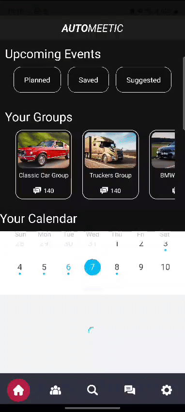
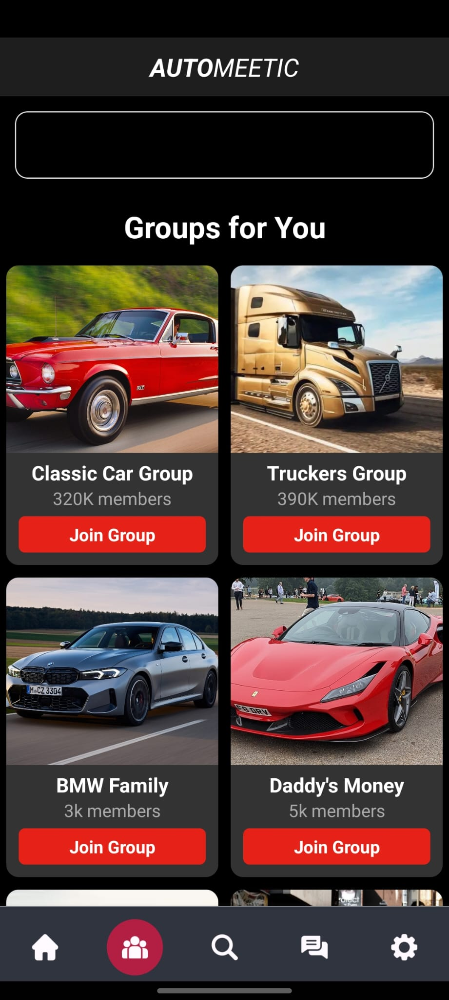
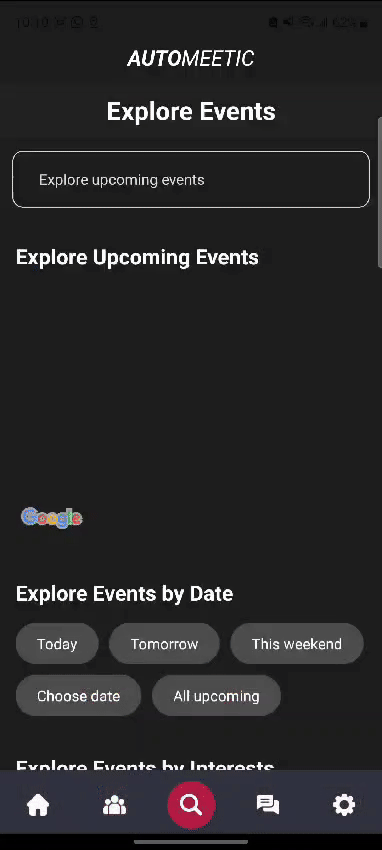
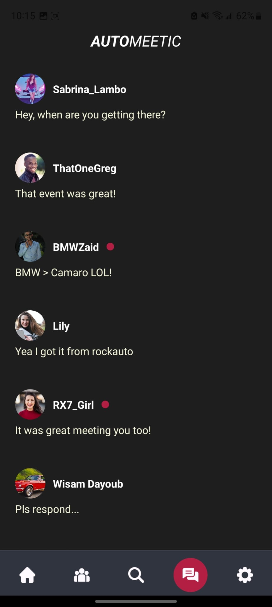
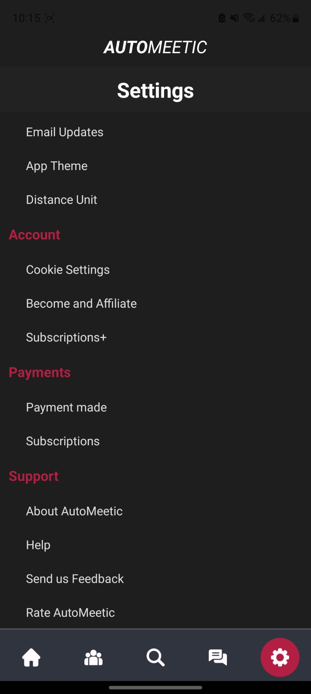

# Automeetic

AutoMeetic is a social platform designed for car enthusiasts to connect and share their passion for cars. Through the app, users can join various car groups, chat with fellow enthusiasts, and organize or participate in car meetups. The app aims to foster a vibrant community where car lovers can come together both online and in person.

## Features

- Upcoming Events: Explore and participate in upcoming car meetups and events.
  
- Join Groups: Connect with like-minded car enthusiasts by joining specific car groups.
  
- Search Upcoming Events: Search for upcoming events near you.
  
- Messaging: Chat with group members and plan meetups.
  
- Personalized Settings: Customize your app experience with various settings options.

## Authors and acknowledgment

- Project Lead: Affan Khan
- Backend Developer: Abdullah Khan
- Designing Intern: Wisam

## Requirments to run: download expo

- npx expo install
- npm install -g expo-cli

## How to run

- go to ./automeetic/ directory
- run command: `npm install`
- run command `npx expo start`

## How to use Git for wisam

- git pull (pulls origin branch)
- git status (view current changes)
- git add . (adds all files changes)
- git commit -m "put ur commenting for the commit here"
- git push (finalize push to origin)
